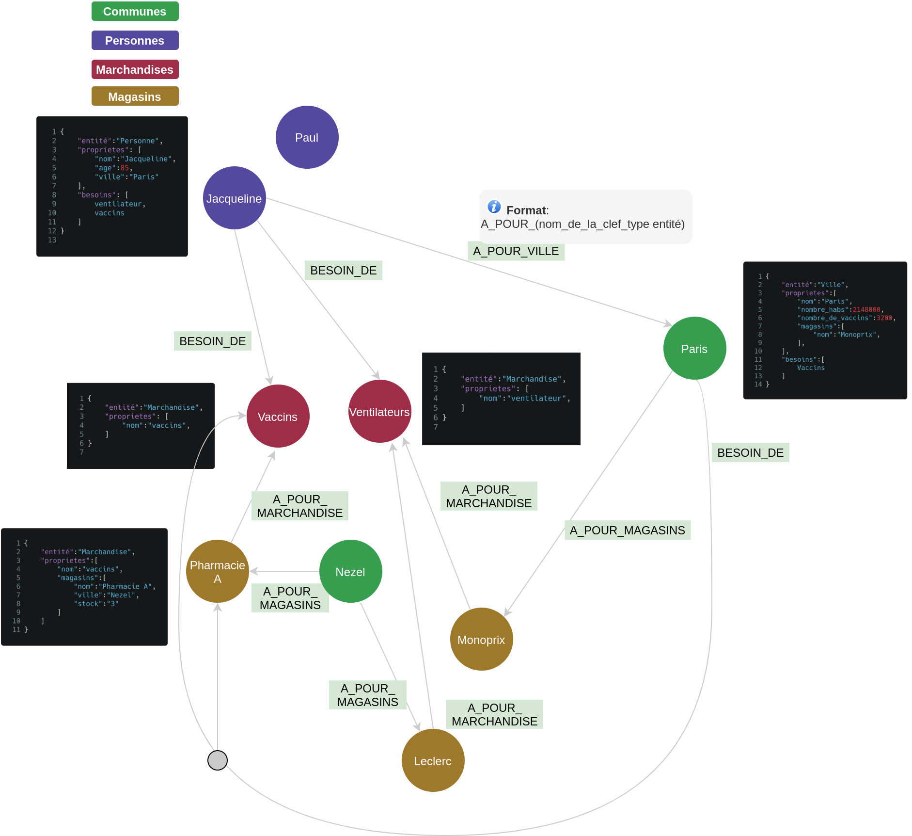

# Objectif

En temps de crise, nous notons qu'il est essentiel de pouvoir apporter à la population des réponses à leurs besoins. Les besoins peuvent être protéiformes (de nature humaine, matérielle...).
Répondre à un besoin revient donc à déterminer les caractéristiques qui sont à l'origine du problème pour y répondre de la façon la plus optimale. Les besoins peuvent être exprimés sous la forme de mots (introduction de la sémantique), c'est grâce à cette sémantique que l'on vient apprendre à mieux caractériser une entité,qu'elle prenne la forme d'une personne, instituton... L'entité peut-être vu comme un objet quelconque.
Les caractéristiques qui composent une entité peuvent ête partagées avec d'autres types d'entités. Le fait que les entités aient des propriétés communes entre elles permettent d'établir des relations. En parcourant ces relations on peut répondre à des besoins spécifiques et pousser de l'information pour certains profils.
Les propriétés qui décrivent les entités de notre modèle de données peuvent ête sourcées manuellement ou automatiquement via des connecteurs sur des bases en opendata.
L'avantage de notre solution est qu'il est simple d'ajuster les besoins en fonction des contraintes liées à la nature de la crise, et de suggérer de nouvelles solutions adaptées issues de l'évolution dynamique de notre modèle de données.

